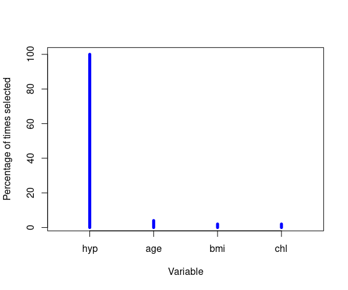

<!-- README.md is generated from README.Rmd. Please edit that file -->

## `miclust`

This package performs cluster analysis with selection of the final
number of clusters and an optional variable selection procedure. The
package is designed to integrate the results of multiple imputation to
deal with missing raw data while accounting for the uncertainty that
such imputations introduce in the final results.

## Getting started

The last version released on CRAN can be installed within an R session
by executing:

``` r
install.packages("miclust")
```

Once the package has been installed, a summary of the main functions is
available using the `help` function:

``` r
library(miclust)
#> 
#> This is miclust 1.2.6. For details, use:
#> > help(package = 'miclust')
#> 
#> To cite the methods in the package use:
#> > citation('miclust')
```

``` r
help(miclust)
```

## Example

### Data

Data `minhanes` is a list with 101 data sets. The first data set
contains `nhanes`data from the `mice` package. The remaining data sets
were obtained by applying the multiple imputation function `mice`, from
the same package. The first step of the analysis is to apply the
`getdata` function to `minhanes`, resulting in `minhanes1`, a list with
two objects: `rawdata`, a `data.frame` containing the raw data, and
`impdata`, a `list` containing the imputed data sets. `getdata`
standardizes all variables, so categorical variables need to have
numeric values. Standardization is performed by centering all variables
at the mean and then dividing by the standard deviation (or the
difference between the maximum and the minimum values for binary
variables). Such a standardization is applied only to the imputed data
sets, except in the case of analyzing just the raw data (i.e. complete
cases analysis), in which raw data are also internally standardized.

``` r
library(miclust)
data(minhanes)
### data preparation:
minhanes1 <- getdata(data = minhanes)
class(minhanes1)
#> [1] "list"   "midata"

### raw data:
minhanes1$rawdata
#>    age  bmi hyp chl
#> 1    1   NA  NA  NA
#> 2    2 22.7   1 187
#> 3    1   NA   1 187
#> 4    3   NA  NA  NA
#> 5    1 20.4   1 113
#> 6    3   NA  NA 184
#> 7    1 22.5   1 118
#> 8    1 30.1   1 187
#> 9    2 22.0   1 238
#> 10   2   NA  NA  NA
#> 11   1   NA  NA  NA
#> 12   2   NA  NA  NA
#> 13   3 21.7   1 206
#> 14   2 28.7   2 204
#> 15   1 29.6   1  NA
#> 16   1   NA  NA  NA
#> 17   3 27.2   2 284
#> 18   2 26.3   2 199
#> 19   1 35.3   1 218
#> 20   3 25.5   2  NA
#> 21   1   NA  NA  NA
#> 22   1 33.2   1 229
#> 23   1 27.5   1 131
#> 24   3 24.9   1  NA
#> 25   2 27.4   1 186

### first (standardized) imputed data set:
minhanes1$impdata[[1]]
#>           age        bmi   hyp        chl
#> 1  -0.9149325  2.0012331 -0.24 -0.1489984
#> 2   0.2889260 -0.9445072 -0.24 -0.1227663
#> 3  -0.9149325  0.4582263 -0.24 -0.1227663
#> 4   1.4927846 -0.2898982  0.76  0.6904293
#> 5  -0.9149325 -1.4822217 -0.24 -2.0639429
#> 6   1.4927846  0.1776796  0.76 -0.2014626
#> 7  -0.9149325 -0.9912650 -0.24 -1.9327823
#> 8  -0.9149325  0.7855307 -0.24 -0.1227663
#> 9   0.2889260 -1.1081594 -0.24  1.2150716
#> 10  0.2889260 -1.4822217 -0.24 -0.1227663
#> 11 -0.9149325  0.6686363 -0.24  0.9789826
#> 12  0.2889260  0.1543007 -0.24  0.3756439
#> 13  1.4927846 -1.1782961 -0.24  0.3756439
#> 14  0.2889260  0.4582263  0.76  0.3231797
#> 15 -0.9149325  0.6686363 -0.24 -0.1227663
#> 16 -0.9149325  0.4582263 -0.24 -0.1227663
#> 17  1.4927846  0.1075429  0.76  2.4217489
#> 18  0.2889260 -0.1028671  0.76  0.1920191
#> 19 -0.9149325  2.0012331 -0.24  0.6904293
#> 20  1.4927846 -0.2898982  0.76 -0.1489984
#> 21 -0.9149325 -1.4822217 -0.24 -1.5917648
#> 22 -0.9149325  1.5102763 -0.24  0.9789826
#> 23 -0.9149325  0.1776796 -0.24 -1.5917648
#> 24  1.4927846 -0.4301716 -0.24  0.3231797
#> 25  0.2889260  0.1543007 -0.24 -0.1489984
```

### Analysis

Multiple imputation clustering process with backward variable selection:

``` r
### using only the imputations 1 to 50 for the clustering process and exploring
### 2 vs. 3 clusters:
minhanes1clust <- miclust(data = minhanes1, search = "backward", ks = 2:3, usedimp = 1:50, seed = 4321)
#> ....imp 5....imp 10....imp 15....imp 20....imp 25....imp 30....imp 35....imp 40....imp 45....imp 50
#> 
#>  Analysis done.
minhanes1clust
#> 
#>    Results using 50 imputations:
#> ------------------------------------------------
#> 
#>                                      k=V1  k=V2
#> Frequency of selection (%)          56.00 44.00
#> Median number of selected variables   1.0   2.0
### optimal number of clusters
minhanes1clust$kfin
#> [1] 2
```

Selection frequency of the variables for the optimal number of clusters:

``` r
y <- getvariablesfrequency(minhanes1clust)
y
#> $percfreq
#> [1] 100   4   2   2
#> 
#> $varnames
#> [1] "hyp" "age" "bmi" "chl"
plot(y$percfreq, type = "h", main = "", xlab = "Variable", ylab = "Percentage of times selected",
     xlim = 0.5 + c(0, length(y$varnames)), lwd = 5, col = "blue", xaxt = "n")
axis(1, at = 1:length(y$varnames), labels = y$varnames)
```



Graphical representation of the results:

``` r
plot(minhanes1clust)
```


Default summary for the optimal number of clusters:

``` r
summary(minhanes1clust)
#> Warning in summary.miclust(minhanes1clust): 'quantilevars' not provided. Setting it to 0.5.
#> 
#> Results using:
#>     50 imputed data sets for the cluster analysis
#>     100 imputed data sets for the descriptive summary
#>     2 as the final number of clusters
#> -----------------------------------------------------------
#> 
#> Presence of the variables in the subset of selected variables:
#>   Variable Presence(%)
#> 1      hyp         100
#> 2      age           4
#> 3      bmi           2
#> 4      chl           2
#> 
#> Selected variables:
#> [1] "hyp"
#> 
#> Cohen's kappa between-imputations distribution (99 comparisons):
#>  2.5%   25%   50%  mean   75% 97.5% 
#>  0.48  0.65  0.78  0.75  0.88  1.00 
#> 
#> Between-imputation clusters size distribution (100 imputations):
#>           size min. 2.5% 25% 50% mean 75% 97.5% max.
#> cluster 1    7    4    4   6   7  6.5   7     9   10
#> cluster 2   18   15   16  18  18 18.5  19    21   21
#> 
#> Probability of assignment to the cluster distribution (100 imputations):
#>                        min   Q1 Q2 Q3 max
#> Assigned to cluster 1 0.51 0.54  1  1   1
#> Assigned to cluster 2 0.52 0.93  1  1   1
#> 
#> Within-cluster summary (100 imputations):
#>     %miss. %miss.(cl.1) %miss.(cl.2) mean (cl.1) sd (cl.1) mean (cl.2)
#> hyp      0            0            0           2         0           1
#>     sd (cl.2)
#> hyp         0
```

Summary forcing 3 clusters:

``` r
summary(minhanes1clust, k = 3)
#> Warning in summary.miclust(minhanes1clust, k = 3): 'quantilevars' not provided. Setting it to 0.5.
#> 
#> Results using:
#>     50 imputed data sets for the cluster analysis
#>     100 imputed data sets for the descriptive summary
#>     3 as the final number of clusters
#> -----------------------------------------------------------
#> 
#> Presence of the variables in the subset of selected variables:
#>   Variable Presence(%)
#> 1      hyp          96
#> 2      age          94
#> 3      bmi          46
#> 4      chl          30
#> 
#> Selected variables:
#> [1] "hyp" "age"
#> 
#> Cohen's kappa between-imputations distribution (99 comparisons):
#>  2.5%   25%   50%  mean   75% 97.5% 
#>     1     1     1     1     1     1 
#> 
#> Between-imputation clusters size distribution (100 imputations):
#>           size min. 2.5% 25% 50% mean 75% 97.5% max.
#> cluster 1   12   12   12  12  12   12  12    12   12
#> cluster 2    7    7    7   7   7    7   7     7    7
#> cluster 3    6    6    6   6   6    6   6     6    6
#> 
#> Probability of assignment to the cluster distribution (100 imputations):
#>                       min Q1 Q2 Q3 max
#> Assigned to cluster 1   1  1  1  1   1
#> Assigned to cluster 2   1  1  1  1   1
#> Assigned to cluster 3   1  1  1  1   1
#> 
#> Within-cluster summary (100 imputations):
#>          %miss. %miss.(cl.1) %miss.(cl.2) %miss.(cl.3) mean (cl.1) sd (cl.1)
#> hyp.mean      0            0            0            0           1         0
#> age.mean      0            0            0            0           1         0
#>          mean (cl.2) sd (cl.2) mean (cl.3) sd (cl.3)
#> hyp.mean         1.4      0.55         1.5      0.58
#> age.mean         2.0      0.00         3.0      0.00
```

## References

The methodology used in the package is described in

-   Basagaña X, Barrera-Gómez J, Benet M, Antó JM, Garcia-Aymerich J. *A
    Framework for Multiple Imputation in Cluster Analysis*. American
    Journal of Epidemiology. 2013;177(7):718-725.
    <a href="https://doi.org/10.1093/aje/kws289" target="_blank">https://doi.org/10.1093/aje/kws289</a>
